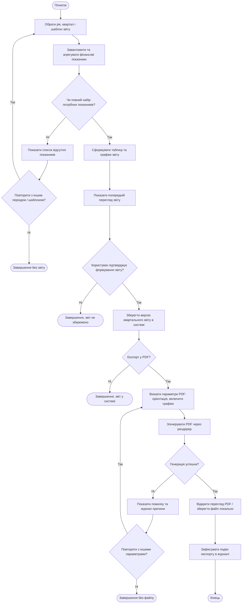

# Діаграма активності: квартальний фінансовий звіт і експорт у PDF

```mermaid
flowchart TB
    start([Початок])
    start --> pick[Обрати рік, квартал і шаблон звіту]
    pick --> load[Завантажити та агрегувати фінансові показники]

    load --> checkData{Чи повний набір потрібних показників?}
    checkData -->|Ні| warn[Показати список відсутніх показників]
    warn --> fixChoice{Повторити з іншим періодом / шаблоном?}
    fixChoice -->|Так| pick
    fixChoice -->|Ні| endAbort([Завершення без звіту])

    checkData -->|Так| build[Сформувати таблиці та графіки звіту]
    build --> preview[Показати попередній перегляд звіту]

    preview --> userOk{Користувач підтверджує формування звіту?}
    userOk -->|Ні| endNoReport([Завершення, звіт не збережено])

    userOk -->|Так| save[Зберегти версію квартального звіту в системі]
    save --> exportAsk{Експорт у PDF?}
    exportAsk -->|Ні| endSaved([Завершення, звіт у системі])

    exportAsk -->|Так| pdfOpts[Вказати параметри PDF: орієнтація, включити графіки]
    pdfOpts --> render[Згенерувати PDF через рендерер]
    render --> renderOk{Генерація успішна?}
    renderOk -->|Ні| err[Показати помилку та журнал причини]
    err --> retry{Повторити з іншими параметрами?}
    retry -->|Так| pdfOpts
    retry -->|Ні| endFail([Завершення без файлу])

    renderOk -->|Так| deliver[Відкрити перегляд PDF / зберегти файл локально]
    deliver --> log[Зафіксувати подію експорту в журналі]
    log --> endOk([Кінець])
```

