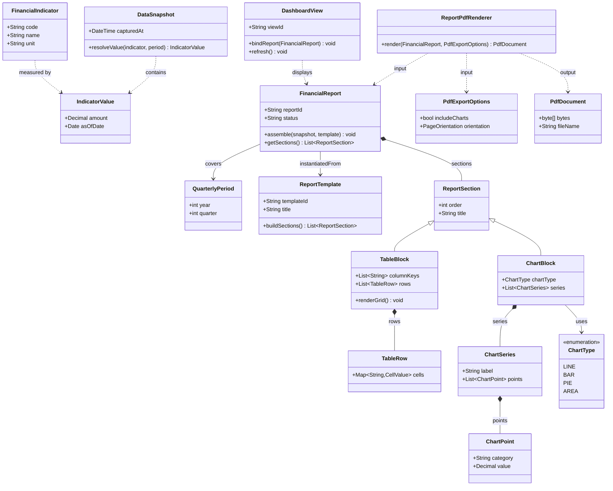

# Структурна діаграма: фінансова звітність (таблиці та графіки)

Фрагмент статичної моделі для представлення квартальної та аналітичної фінансової інформації у табличному та графічному вигляді, плюс експорт у PDF.

## Короткі пояснення зв’язків

| Елемент | Призначення |
|--------|-------------|
| `DataSnapshot`, `FinancialIndicator`, `IndicatorValue` | Нормалізований зріз чисел за періодом для побудови звіту. |
| `ReportTemplate` | Правила розміщення блоків; `FinancialReport` збирає конкретний екземпляр за кварталом. |
| `TableBlock`, `ChartBlock` | Два види подання одного й того ж змісту в UI та в PDF. |
| `ReportPdfRenderer` | Перетворює вже зібраний `FinancialReport` на `PdfDocument`. |
| `DashboardView` | Компонент інтерфейсу, що відображає звіт користувачу (таблиці + графіки). |
