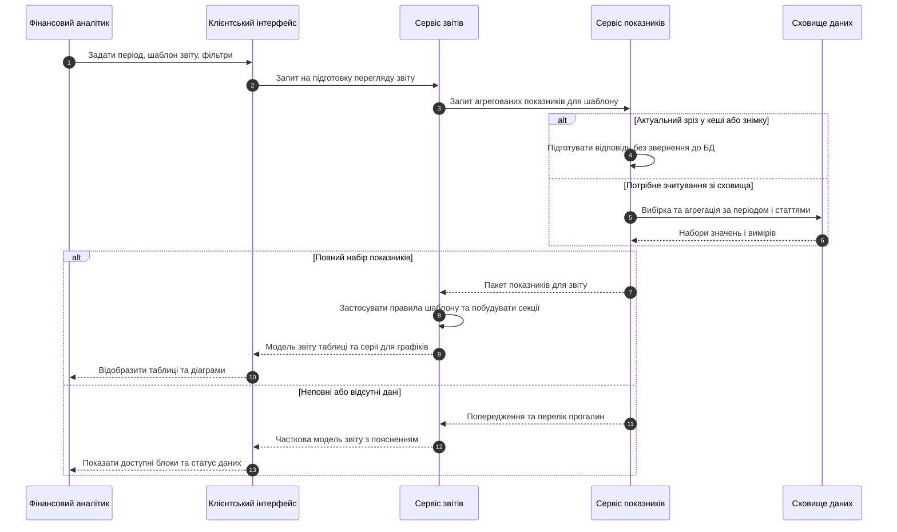

# Діаграма послідовності: показники, підготовка звіту, відображення

Учасники: **фінансовий аналітик** (так само може бути керівник у режимі перегляду), **клієнтський інтерфейс**, **сервіс звітів**, **сервіс показників**, **сховище даних** (БД або інтеграційний шар до джерел).

## Пояснення

| Етап | Зміст |
|------|--------|
| Запит користувача | Період, шаблон, фільтри через **клієнтський інтерфейс** до **сервісу звітів**. |
| Отримання показників | **Сервіс показників** або бере з кешу або знімку, або зчитує та агрегує у **сховищі даних**. |
| Успіх | Сервіс звітів будує секції; інтерфейс показує таблиці та графіки. |
| Неповні дані | Повертається часткова модель і пояснення; користувач бачить статус прогалин. |

Перегляд: GitHub або VS Code з Mermaid, або [mermaid.live](https://mermaid.live).
